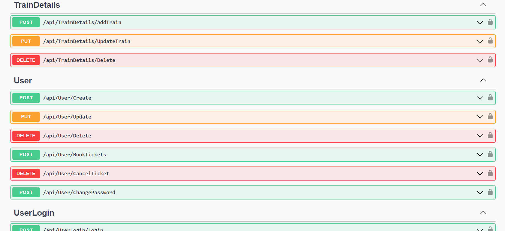
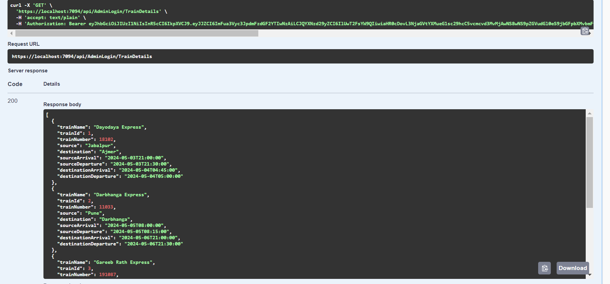
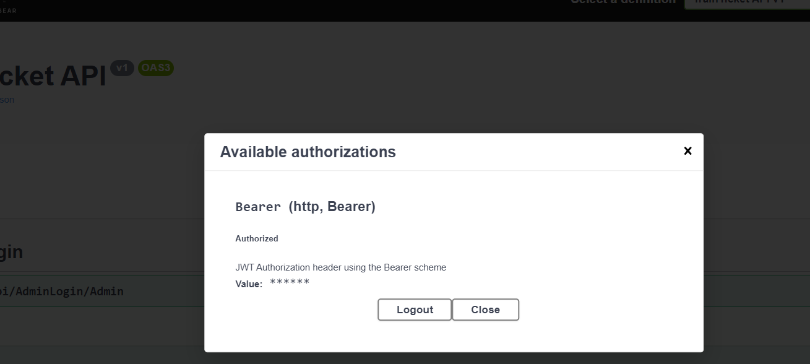

# Ticket Reservation API 
Created API for ticket reservation system using .NET. 

## Table of Contents

- [Introduction](#introduction)
- [Installation](#installation)
  - [Steps](#steps)
  - [Prerequisites](#prerequisites) 
- [Usage](#usage)
- [Images](#images)

## Introduction
Welcome to the ASP.NET API designed to streamline ticket reservation processes. This application caters to two distinct roles:
- **Admin**: Responsible for comprehensive CRUD operations related to managing train details and seat allocations.
- **User**: Enables users to manage their profiles efficiently, facilitating ticket booking and cancellation seamlessly.
- **Other Functionalities**: <ul><li>Used JWT token for authorization and SMTP for email sending.</li><li>Everytime a new train is added 10 seats(for each of 3AC , 2AC, 1AC , Sleeper, General)</li></ul>

## Installation

### Steps
<ul>
<li>Clone the github repository : git clone https://github.com/ishaj72/RailwayTicketAPI.git</li>
<li>Navigate to the project : cd RailwayTicketAPI</li>
<li>Start your project : dotnet run</li>
</ul>

### Prerequisites
- Node.js
- npm (install using npm install npm@latest -g)
- .NET SDK 8.0 version
- Entity Framework Core (for database interactions)
- A compatible database (Used Here - MSSQL Server)
- NuGET Package Manager to install packages for smtp , jwt , sql , entity framework and other functionalities

## For Migration of Database
- Add-Migration "your-migration-name"
- Update-Database

## Usage

Here's how you can leverage this API on your role:
### For Admins:
- Add new trains to expand the service offerings.
- Manage seat configurations to optimize capacity.
- Update and delete existing train and seat details as needed.

### For Users:
- Register or log in to manage your profile.
- Book tickets for preferred train routes.
- Cancel booked tickets if plans change.

## Link to Frontend repository 
https://github.com/ishaj72/TicketUI--React

## Images
- API images

- JWT Authorization

